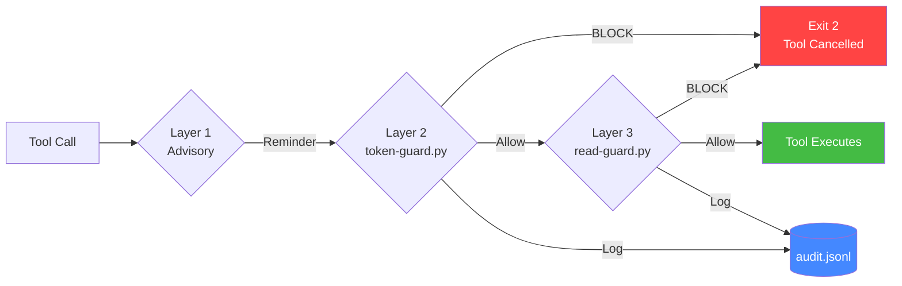

<p align="center">
<pre align="center">
   _____ _                 _        _____     _                  ____                     _
  / ____| |               | |      |_   _|   | |                / ___|_   _  __ _ _ __ __| |
 | |    | | __ _ _   _  __| | ___    | | ___ | | _____ _ __    | |  _| | | |/ _` | '__/ _` |
 | |    | |/ _` | | | |/ _` |/ _ \   | |/ _ \| |/ / _ \ '_ \  | |_| | |_| | (_| | | | (_| |
 | |____| | (_| | |_| | (_| |  __/   | | (_) |   <  __/ | | |  \____|\__,_|\__,_|_|  \__,_|
  \_____|_|\__,_|\__,_|\__,_|\___|   |_|\___/|_|\_\___|_| |_|
</pre>
</p>

<h3 align="center">Stop Claude Code from burning your API budget.</h3>
<p align="center">Mechanical enforcement, not suggestions. <code>sys.exit(2)</code> can't be rationalized.</p>

<p align="center">
  <a href="#"></a>
  <a href="#"></a>
  <a href="LICENSE"></a>
  <a href="#"></a>
  <a href="#"></a>
  <a href="CONTRIBUTING.md"></a>
</p>

---

## The Problem

Every Claude Code user has felt this pain:

- Claude spawns **5 Explore agents** to map a codebase when **1 Grep** would find the answer — **~$2.50 wasted in 10 seconds**
- Re-reads the **same file 6 times** because it "forgot" it already read it — **~$0.80 per re-read**
- Fires off **13 sequential Read calls** one-at-a-time instead of batching them in parallel — **context window bloat compounds every turn**
- You write rules in `CLAUDE.md` saying "don't do this" — **it rationalizes past them every time**

> *"This case is different." "The user needs comprehensive coverage." "I should be thorough."*
>
> LLMs are world-class rationalizers. Written rules are suggestions. You need enforcement.

## The Solution

**`sys.exit(2)` can't be rationalized.**

When a Claude Code hook exits with code 2, the tool call is **cancelled**. The agent never spawns. The file never gets re-read. The LLM gets an error message explaining what to do instead. It's not a suggestion — it's a wall.

```
BLOCKED: Already spawned a Explore agent this session. Max 1 per session.
Merge your queries into one agent, or use Grep/Read/WebSearch directly
instead of spawning another.
```

```
BLOCKED: 'main.py' read 3 times already. Trust your first read.
Use Grep for specific lines.
```

```
BLOCKED: This task can be handled with direct tools.
Use Grep to search for code patterns directly.
Agents cost ~50k tokens. Direct tools cost ~2-10k.
```

## Architecture

Three-layer defense-in-depth — the same pattern used in nuclear safety systems, Anthropic's Constitutional AI, and OpenAI's safety pipeline:



| Layer | File | What It Does |
|-------|------|-------------|
| Advisory | `settings.json` prompt hook | Reminds the AI of token rules before every Task call |
| Agent Enforcement | `token-guard.py` | Hard-blocks agent spawns (7 rules + anti-evasion) |
| Read Enforcement | `read-efficiency-guard.py` | Hard-blocks duplicate/sequential reads |
| Self-Healing | `self-heal.py` | Validates and repairs the system on every session start |
| Shared Infrastructure | `hook_utils.py` | Portable locking, atomic writes, audit logging |

## Quick Start

```bash
# 1. Clone
git clone https://github.com/DrewDawson2027/claude-token-guard.git

# 2. Copy the hooks into your Claude Code config
cp claude-token-guard/{token-guard.py,read-efficiency-guard.py,hook_utils.py,self-heal.py} \
   ~/.claude/hooks/

# 3. Copy the config
cp claude-token-guard/token-guard-config.json ~/.claude/hooks/

# 4. Register the hooks in your settings.json (see Configuration below)

# 5. Verify
cd claude-token-guard && python3 -m pytest tests/ -v
```

**That's it.** Zero dependencies. Pure Python standard library.

## What It Catches

| Pattern | What Happens | Tokens Saved |
|---------|-------------|-------------|
| 2nd Explore agent in same session | **BLOCKED** — "Max 1 per session. Merge queries." | ~50,000 |
| "Search for function X" as agent task | **BLOCKED** — "Use Grep directly." | ~48,000 |
| Same file read 3+ times | **BLOCKED** — "Trust your first read." | ~5,000/read |
| 10+ sequential reads in 90s | **BLOCKED** — "Batch into parallel groups." | ~20,000+ |
| Type-switching evasion (Explore blocked → tries general-purpose) | **BLOCKED** — "Resembles a previously blocked attempt." | ~50,000 |
| Rapid-fire agent spawns (<5s apart) | **BLOCKED** — "Wait between spawns." | ~50,000 |
| Agent in Explore'd directory | **WARNED** — "Already mapped by Explore." | Advisory |
| Opus model requested for agent | **WARNED** — "Opus costs ~3x more." | Advisory |

## Configuration

Edit `~/.claude/hooks/token-guard-config.json`:

| Option | Type | Default | Description |
|--------|------|---------|-------------|
| `max_agents` | int | `5` | Maximum agents per session |
| `parallel_window_seconds` | int | `30` | Block same-type spawns within this window |
| `global_cooldown_seconds` | int | `5` | Minimum seconds between any spawns |
| `max_per_subagent_type` | int | `1` | Max of any single agent type |
| `state_ttl_hours` | int | `24` | Auto-cleanup session state after this |
| `audit_log` | bool | `true` | Enable/disable audit logging |
| `one_per_session` | list | `["Explore", "Plan", ...]` | Types limited to exactly 1 |
| `always_allowed` | list | `["claude-code-guide", ...]` | Types that bypass all rules |

### Hook Registration

Add to your `~/.claude/settings.json`:

```json
{
  "hooks": {
    "PreToolUse": [
      {
        "matcher": "Task",
        "hooks": [
          {
            "type": "command",
            "command": "python3 ~/.claude/hooks/token-guard.py"
          }
        ]
      },
      {
        "matcher": "Read",
        "hooks": [
          {
            "type": "command",
            "command": "python3 ~/.claude/hooks/read-efficiency-guard.py"
          }
        ]
      }
    ],
    "SessionStart": [
      {
        "hooks": [
          {
            "type": "command",
            "command": "python3 ~/.claude/hooks/self-heal.py"
          }
        ]
      }
    ]
  }
}
```

## The 7 Enforcement Rules

1. **One-per-session types** — Explore, Plan, deep-researcher: max 1, ever
2. **General type cap** — max N of any single subagent_type (default 1)
3. **Session agent cap** — max total agents per session (default 5)
4. **Parallel window** — no same-type spawns within 30 seconds
5. **Necessity scoring** — 10 regex patterns detect tasks better done with direct tools
6. **Type-switching detection** — catches "blocked as Explore, retry as general-purpose" (similarity >0.6)
7. **Global cooldown** — prevents rapid-fire spawns of any type

**Plus:** Resume detection (always allows continuing existing agents), team awareness (bypasses rules for team spawns but counts toward cap), first-spawn advisory, and model cost warnings.

## Analytics

```bash
python3 ~/.claude/hooks/token-guard.py --report
```

```
========================================
  TOKEN GUARD ANALYTICS
========================================
Total attempts: 63
Allowed: 53 (84%)
Blocked: 10 (16%)
Resumes: 4
Team spawns: 2

Top agent types:
  Explore: 12
  general-purpose: 9
  master-coder: 8

Block reasons:
  one_per_session limit: 4
  necessity_check: 3
  session_cap limit: 2
  type_switching: 1

Necessity patterns triggered:
  search_grep: 2
  read_file: 1

Unique sessions: 8
========================================
```

## Test Suite

**96 tests. Zero known bugs. Zero dependencies.**

```
tests/test_token_guard.py           — 51 tests (all 7 rules, config edge cases, anti-evasion)
tests/test_read_efficiency_guard.py — 27 tests (duplicate blocking, escalation, post-Explore)
tests/test_integration.py           —  6 tests (cross-hook coordination, concurrent access)
tests/test_self_heal.py             — 12 tests (all 5 repair phases, audit rotation)
```

```bash
python3 -m pytest tests/ -v   # Run the full suite
```

## Before / After

| Metric | Without Guard | With Guard |
|--------|:------------:|:----------:|
| Agents spawned per session | 8-12 | 2-4 |
| Duplicate file reads | 5-6 per file | Max 2 |
| Sequential reads per turn | 10-13 | 3-4 (batched) |
| Tokens per session | ~400k | ~150k |
| Estimated cost per session | ~$3.00 | ~$1.10 |

*Based on real usage data from the audit log across 63 agent spawn attempts.*

## vs Alternatives

| Feature | Claude Token Guard | CLAUDE.md Rules | claude-code-guardrails | Manual Monitoring |
|---------|:------------------:|:---------------:|:---------------------:|:-----------------:|
| Actually blocks wasteful calls | **Yes** | No (advisory only) | Yes (cloud-based) | No |
| Zero dependencies | **Yes** | Yes | No (needs Rulebricks) | N/A |
| Self-hosted | **Yes** | Yes | No (cloud API) | Yes |
| Anti-evasion detection | **Yes** | No | No | No |
| Self-healing | **Yes** | No | No | No |
| Audit analytics | **Yes** | No | Yes | No |
| Test suite | **96 tests** | N/A | None published | N/A |
| Setup time | 2 minutes | 0 | 5 minutes | Ongoing |

## How It Works Under the Hood

### Atomic State Management
All state writes use `tempfile.mkstemp()` + `os.replace()` — if the process crashes mid-write, the original file is untouched. Portable across macOS, Linux, and Windows.

### File Locking
Shared state is protected by exclusive file locks (`fcntl.flock` on Unix, `msvcrt.locking` on Windows). No race conditions from concurrent hooks.

### Fail-Open Philosophy
If anything goes wrong (can't create state dir, can't parse input, can't acquire lock), the hook exits 0 and **allows the tool call**. False negatives are better than false positives — a bug in the guard should never block legitimate work.

### Bounded Growth
Every array has a TTL:
- Read records: 5 minutes
- Blocked attempts: 5 minutes
- Session state files: 24 hours
- Audit log: rotated at 10K lines

## FAQ

**Q: Will this break my Claude Code sessions?**
A: No. Every hook follows the fail-open principle. If anything goes wrong, it allows the tool call. The guard can only *block*, never *crash*.

**Q: Can Claude learn to bypass this?**
A: The type-switching detector catches evasion attempts (similarity matching on descriptions). The necessity scorer catches "same task, different words." But if Claude genuinely needs more agents, increase `max_agents` in the config.

**Q: Does this work on Windows?**
A: Yes. Portable file locking uses `msvcrt` on Windows and `fcntl` on Unix. Tested primarily on macOS.

**Q: How do I see what's being blocked?**
A: Run `python3 ~/.claude/hooks/token-guard.py --report` for full analytics, or check `~/.claude/hooks/session-state/audit.jsonl` directly.

**Q: What if I need more than 5 agents?**
A: Edit `max_agents` in `~/.claude/hooks/token-guard-config.json`. The default of 5 is intentionally conservative.

**Q: Does this add latency?**
A: ~10-20ms per tool call. Negligible compared to the API round-trip.

## Contributing

See [CONTRIBUTING.md](CONTRIBUTING.md). PRs welcome, especially:
- New necessity scoring patterns (with tests)
- Threshold tuning backed by audit data
- Windows/Linux testing
- Documentation improvements

## License

[MIT](LICENSE) — use it however you want.

---

<p align="center">
  <strong>If this saved you money, <a href="https://github.com/DrewDawson2027/claude-token-guard">star the repo</a>.</strong>
  <br>
  Built with frustration, tested with rigor.
</p>
